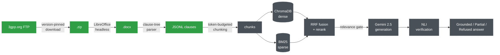

# SpecRAG

**Retrieval-augmented Q&A over official 3GPP Release-18 specifications.**

Ask a question about NR RRC procedures, 5G security, or NAS signaling and get an answer grounded in the actual standard text — with citations, not hallucinations.

<p>
  
  
  
  
  
</p>

---

## Why this exists

3GPP specifications are precise, cross-referenced, and *hostile* to keyword search. The same acronym means different things across series, requirements ("shall") are conditioned on clauses two pages away, and mixing spec releases silently produces answers that are internally consistent and completely wrong. Generic RAG-over-PDF tooling ignores all of this. SpecRAG is built around it.

## What makes it different

<table>
<tr><td width="34"><b>1</b></td><td><b>Version pinning is load-bearing, not cosmetic.</b><br>Every spec is resolved to a single 3GPP Release (18, "5G-Advanced") at download time, and the exact version is written to a manifest. Rel-15 and Rel-18 text can flatly contradict each other — retrieval doesn't know that, so the pipeline has to.</td></tr>
<tr><td><b>2</b></td><td><b>Chunking respects the clause tree, not the page.</b><br>The parser walks the docx body in document order (not python-docx's disconnected paragraph/table lists) to keep a <code>shall</code> and its triggering condition in the same chunk. Tables become GFM markdown; ASN.1 blocks are kept intact by paragraph style, not regex guessing.</td></tr>
<tr><td><b>3</b></td><td><b>A relevance gate before the LLM ever runs.</b><br>Hybrid dense + BM25 retrieval is fused (RRF) and reranked; below a calibrated score threshold, the system refuses rather than lets the LLM improvise from noise.</td></tr>
<tr><td><b>4</b></td><td><b>Answers are checked against source text before being shown.</b><br>An NLI verification pass grades every generated claim <em>Grounded</em>, <em>Partial</em> (unsupported parts stripped), or <em>Refused</em> — so a wrong answer about a protocol parameter doesn't quietly ship.</td></tr>
</table>

## Pipeline



<sub>🟢 solid = implemented and tested against real spec files &nbsp;&nbsp;·&nbsp;&nbsp; ⬛ dashed = scaffolded, not yet built</sub>

## Status

| Stage | Module | State |
|---|---|---|
| Download + version pin | `src/ingest/download.py` | ✅ Done |
| `.doc` → `.docx` normalization | `src/ingest/convert.py` | ✅ Done |
| Clause-tree parsing | `src/ingest/parse_docx.py` | ✅ Done |
| Chunking | `src/index/` | ⬜ Scaffolded |
| Dense + BM25 indexing | `src/index/` | ⬜ Scaffolded |
| Retrieval (fusion + rerank) | `src/retrieval/` | ⬜ Scaffolded |
| Generation (Gemini) | `src/generation/` | ⬜ Scaffolded |
| Verification (NLI grading) | `src/verification/` | ⬜ Scaffolded |
| API (FastAPI) | `src/api/` | ⬜ Scaffolded |
| UI (Streamlit) | `src/ui/` | ⬜ Scaffolded |

## Corpus (Release 18)

<details>
<summary><b>15 specs across RAN, core network, security, and vocabulary</b> — click to expand</summary>
<br>

| Series | Spec | Title |
|---|---|---|
| RAN | 38.300 | NR and NG-RAN Overall Description |
| RAN | 38.331 | NR RRC Protocol Specification |
| RAN | 38.321 | NR MAC Protocol Specification |
| RAN | 38.322 | NR RLC Protocol Specification |
| RAN | 38.323 | NR PDCP Protocol Specification |
| RAN | 38.401 | NG-RAN Architecture Description |
| RAN | 38.211 | NR Physical Channels and Modulation |
| RAN | 38.212 | NR Multiplexing and Channel Coding |
| RAN | 38.213 | NR Physical Layer Procedures for Control |
| RAN | 38.214 | NR Physical Layer Procedures for Data |
| Core | 23.501 | System Architecture for the 5G System |
| Core | 23.502 | Procedures for the 5G System |
| Core | 24.501 | NAS Protocol for 5G System |
| Security | 33.501 | Security Architecture and Procedures for 5G System |
| Vocabulary | 21.905 | Vocabulary for 3GPP Specifications |

</details>

## Quick start

> Windows / PowerShell, from inside `rag3gpp/`. GPU (CUDA) is required — embedding this corpus on CPU is impractically slow.

```powershell
# 1. Virtual environment
python -m venv venv
.\venv\Scripts\Activate.ps1

# 2. PyTorch with CUDA — before everything else, or you'll silently get a CPU build
pip install torch --index-url https://download.pytorch.org/whl/cu121
python -c "import torch; print(torch.cuda.is_available())"   # must print True

# 3. Everything else
pip install -r requirements.txt

# 4. API key
copy .env.example .env
# open .env, paste your Gemini key from https://aistudio.google.com/apikey

# 5. LibreOffice (for legacy .doc -> .docx conversion)
# https://www.libreoffice.org/download
```

Full walkthrough, troubleshooting table, and what to expect at each step: [SETUP.md](SETUP.md).

### Run the ingestion pipeline

```powershell
python -m src.ingest.download --spec 38.331   # one spec first, to prove the plumbing works
python -m src.ingest.download                 # then the full Rel-18 corpus
python -m src.ingest.convert                  # normalise any .doc -> .docx
python -m src.ingest.parse_docx                # build the clause-tree JSONL
```

Check `data/raw/manifest.tsv` afterward — every row should say `Rel-18`. If one doesn't, that spec has no Rel-18 version published yet and the downloader fell back to the newest available, which breaks version pinning.

## Project layout

```
rag3gpp/
├── src/
│   ├── config.py          # every tunable constant — thresholds, model names, paths
│   ├── ingest/
│   │   ├── download.py    # version-pinned fetch from 3gpp.org
│   │   ├── convert.py     # .doc -> .docx via LibreOffice headless
│   │   └── parse_docx.py  # docx -> clause-tree JSONL
│   ├── index/              # chunking + ChromaDB/BM25 (planned)
│   ├── retrieval/          # fusion + reranking (planned)
│   ├── generation/         # Gemini answer synthesis (planned)
│   ├── verification/       # NLI grounding checks (planned)
│   ├── api/                 # FastAPI service (planned)
│   └── ui/                  # Streamlit front end (planned)
├── data/                    # raw/docx/parsed/chunks/index — gitignored except manifest
├── SETUP.md
└── requirements.txt
```

## Tech stack

Python 3.11 · PyTorch (CUDA) · sentence-transformers (`BAAI/bge-m3`) · `bge-reranker-v2-m3` · ChromaDB · rank-bm25 · Gemini 2.5 · cross-encoder NLI · FastAPI · Streamlit
