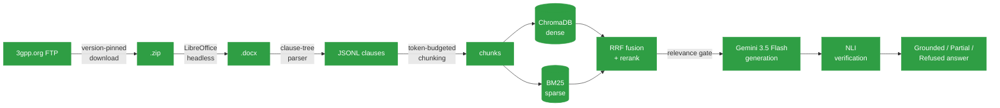

# SpecRAG

**Retrieval-augmented Q&A over official 3GPP Release-18 specifications.**

Ask a question about NR RRC procedures, 5G security, or NAS signaling and get an answer grounded in the actual standard text — with citations, not hallucinations.

<p>
  
  
  
  
  
</p>

---

## Why this exists

3GPP specifications are precise, cross-referenced, and *hostile* to keyword search. The same acronym means different things across series, requirements ("shall") are conditioned on clauses two pages away, and mixing spec releases silently produces answers that are internally consistent and completely wrong. Generic RAG-over-PDF tooling ignores all of this. SpecRAG is built around it.

## What makes it different

<table>
<tr><td width="34"><b>1</b></td><td><b>Version pinning is load-bearing, not cosmetic.</b><br>Every spec is resolved to a single 3GPP Release (18, "5G-Advanced") at download time, and the exact version is written to a manifest. Rel-15 and Rel-18 text can flatly contradict each other — retrieval doesn't know that, so the pipeline has to.</td></tr>
<tr><td><b>2</b></td><td><b>Chunking respects the clause tree, not the page.</b><br>The parser walks the docx body in document order (not python-docx's disconnected paragraph/table lists) to keep a <code>shall</code> and its triggering condition in the same chunk. Tables become GFM markdown; ASN.1 blocks are kept intact by paragraph style, not regex guessing.</td></tr>
<tr><td><b>3</b></td><td><b>A relevance gate before the LLM ever runs.</b><br>Hybrid dense + BM25 retrieval is fused (RRF) and reranked; below a calibrated score threshold, the system refuses rather than lets the LLM improvise from noise.</td></tr>
<tr><td><b>4</b></td><td><b>Answers are checked against source text before being shown.</b><br>An NLI verification pass grades every generated claim <em>Grounded</em>, <em>Partial</em> (unsupported parts stripped), or <em>Refused</em> — so a wrong answer about a protocol parameter doesn't quietly ship.</td></tr>
</table>

## Pipeline



## Status

The full pipeline is built and the index is live: **9,577 chunks / 4.94M tokens
across 15 Release-18 specs**, embedded with bge-m3 and indexed in both ChromaDB
and BM25.

| Stage | Module | State |
|---|---|---|
| Download + version pin | `src/ingest/download.py` | ✅ Done |
| `.doc` → `.docx` normalization | `src/ingest/convert.py` | ✅ Done |
| Clause-tree parsing | `src/ingest/parse_docx.py` | ✅ Done |
| Structure-aware chunking | `src/ingest/chunk.py` | ✅ Done — 0 orphaned conditions |
| Dense index (bge-m3 → ChromaDB) | `src/index/` | ✅ Done — 9,577 vectors |
| Sparse index (BM25, hand-rolled) | `src/index/bm25_store.py` | ✅ Done — 53,134 terms |
| Retrieval (RRF fusion + rerank) | `src/retrieval/` | ✅ Done |
| Generation (Gemini) | `src/generation/answer.py` | ✅ Done |
| Verification (NLI + LLM judge) | `src/verification/` | ✅ Done |
| API (FastAPI) | `src/api/main.py` | ✅ Done |
| UI (Streamlit) | `src/ui/app.py` | ✅ Done |
| Gate calibration | `eval/calibrate.py` | ✅ Done — threshold fitted |
| Ablation study | `eval/run_eval.py` | ✅ Done — retrieval + answer arms |

## Results

### Retrieval ablation (55 answerable questions)

Each arm is the real pipeline with stages switched off, not a re-implementation
— `Retriever()` takes the ablation flags directly, so an arm cannot accidentally
flatter itself.

| Arm | Recall@6 | Recall@20 | MRR@20 | nDCG@6 | s/query |
|---|---|---|---|---|---|
| A — dense only | 0.818 | 0.945 | 0.588 | 0.635 | 0.05 |
| B — + hybrid (BM25 + RRF) | 0.855 | **0.927** | 0.660 | 0.703 | 0.04 |
| C — + cross-encoder rerank | 0.855 | 0.927 | **0.679** | 0.704 | 1.74 |

Read honestly, this table says three things, and only the first is flattering:

- **Hybrid retrieval earns its place.** Recall@6 +3.7pts, MRR +7.2pts, nDCG
  +6.8pts, at no measurable latency cost. Exact-term matching is worth a lot in
  a corpus this full of acronyms and IE names.
- **Hybrid also *costs* recall deeper in the list** — Recall@20 drops from 0.945
  to 0.927. RRF pulls BM25 hits into the candidate pool that displace dense hits
  which were further down but still correct. Better at the top, slightly worse
  at the tail.
- **The cross-encoder barely moves retrieval metrics** (+1.9pts MRR, +0.1pt
  nDCG) while costing ~40× the latency. Its real justification in this system is
  not ranking — it is that it produces the score the relevance gate needs. There
  is no gate without it.

### Answer ablation (55 answerable + 22 unanswerable)

These three arms retrieve identically — arm C's retrieval — and differ only in
what they refuse. A non-refused answer to an unanswerable question is a
hallucination by construction, so that column needs no human labelling.

| Arm | Hallucination rate | Coverage | Gold-citation rate | Faithfulness |
|---|---|---|---|---|
| C — no gate, no verification | **0.0%** | 96.4% | 84.9% | — |
| D — + relevance gate | **0.0%** | 85.5% | 87.2% | — |
| E — + groundedness verification | **0.0%** | 43.6% | 83.3% | 0.933 |

**The headline result is real but it is not the one the design predicted.**
Hallucination rate is 0% across all three arms — including arm C, with both the
gate and verification switched off. The gate did not cause that number, and
saying otherwise would misread the table.

What actually catches the out-of-scope questions is **control #3**: the
generation schema has an explicit `answerable: false` field, and the model uses
it on all 22. Giving refusal its own output slot — rather than making it compete
with a fluent guess in the same slot — turns out to do the heavy lifting here.

That leaves the gate and the verifier costing coverage for no measured safety
gain on this set: 96.4% → 85.5% → 43.6%. The honest reading of each:

- **The gate (arm D)** buys two things the table cannot show. It refuses without
  spending an LLM call, and it does not depend on the model cooperating — if a
  future model ignored the schema, control #3 would fail silently and the gate
  would not. It is insurance, and this eval set never files a claim. It also
  raised gold-citation from 84.9% to 87.2%, so the questions it dropped were
  ones the retriever was weak on anyway.
- **The verifier (arm E)** is over-refusing, and the cause is the NLI model, not
  the policy. `nli-deberta-v3-base` was trained on short everyday sentence pairs
  and is out of distribution on 900-token clauses of 3GPP legalese; on the
  answers it refuses, *no* claim clears the bar. Because per-claim scores are
  sharply bimodal (p25 0.05, median 0.89), lowering `PARTIAL_THRESHOLD` would not
  recover them — there is nothing in the middle to recover. Note also that
  `--judge both` would refuse *more*, not less: the two-judge rule takes the
  minimum, so adding a judge can only lower a score.

  Faithfulness of 0.933 on what it does serve says the surviving claims are
  solidly grounded. The fix is a verifier that can read this register — an
  NLI model fine-tuned on technical text, or the LLM judge alone rather than as
  a minimum — not a threshold tweak.

  A concrete instance, from `python -m src.demo` on clause 5.3.3.7: thirteen
  claims, seven scoring 0.97–1.00, one flagged CONTRADICTED at 0.00 — and the
  policy "any contradicted claim refuses outright" discarded the whole answer.
  The flagged claim (`the UE shall set locationInfo to include
  commonLocationInfo`) is not actually contradicted by its passage; it is an NLI
  false positive of exactly the kind this model produces on legalese. So one
  unreliable signal currently holds veto power over seven reliable ones.

  That policy has **deliberately been left as it is.** Loosening a safety control
  because it is inconvenient is how these systems rot, and the contradiction veto
  is correct when the judge is trustworthy. The defensible change is to make the
  veto conditional on the LLM judge — which can read this register — rather than
  on the NLI model, and that needs validating on a larger set than a deadline
  allowed. It is written down here rather than quietly tuned away.

An earlier version of arm E measured **18.2%** coverage. That was a bug, not a
result: `verify()` gated the whole answer on the MEAN claim score, and with a
bimodal distribution the mean lands in the empty middle. One answer scored claims
`[0.87, 0, 0, 0, 0.98, 0, 0, 0, 0.81, 0.3, 0.97, 0.92, 0.98, 0.99, 0.99, 0.93]`
→ mean 0.55 → refused, discarding nine well-supported claims. The policy is now
per-claim, which is what the module always documented.

### Gate calibration

`RERANK_SCORE_THRESHOLD` was a placeholder of `0.0`. Calibration found that the
reranker emits **sigmoid outputs in [0, 1]**, not the signed logits the code
assumed — so `score < 0.0` was never true and **the gate had never fired once**.

Fitted on the 77-question gold set (`eval/calibrate.py`), maximising
correct-refusal subject to a 10% false-refusal budget:

| | |
|---|---|
| **Threshold** | **0.90** |
| Refuses unanswerable | 77% (17/22) |
| Refuses answerable (the price) | 4% (2/55) |
| Youden's J optimum (reference) | 0.90 — agrees |

The 5 out-of-scope questions that still get through are all *plausible fiction*
— `RRCQuantumResume`, `drx-NeuralInactivityTimer`, `Predictive Buffer Status
Report`. They reuse real 3GPP vocabulary, so the reranker legitimately finds
related passages and scores them high. Catching those is precisely the job of
controls #3 and #4 downstream.

### How the gold set was built, and where it flatters the numbers

`eval/gold.jsonl` is 55 answerable questions with verified clause labels plus 22
unanswerable ones. Every gold clause was checked to exist in the chunked corpus
before use — a label pointing at a clause that isn't there makes recall silently
wrong rather than visibly broken.

Three caveats a reader should apply to the numbers above:

- **The questions were written from clause titles**, so their wording overlaps
  the target more than a real engineer's phrasing would. Recall@6 of 0.855 is
  therefore an optimistic ceiling, not a field estimate. The honest fix is
  questions written from clause *bodies* by someone who has not seen the titles.
- **55 questions is small.** A single question is worth 1.8 points of recall, so
  differences under ~4 points between arms are inside the noise. The hybrid gain
  (+3.7) is at the edge of that; the rerank gain (+0.0 recall) is not
  distinguishable from zero.
- **The unanswerable set is deliberately tiered** (off-domain, adjacent-tech,
  plausible fiction) rather than sampled from real traffic. That makes the
  correct-refusal rate a measure of *which kinds* of out-of-scope question the
  gate catches, which is more useful here than a single blended percentage — but
  it is not a traffic-weighted number.

### `temperature=0` is not reproducibility

Worth stating because the code comments claim temperature 0 is what makes these
numbers reproducible, and that turns out to be only half true.

The **retrieval** arms reproduced bit-exactly across three separate runs
(0.818 / 0.945 / 0.588 / 0.635 for arm A every time) — everything there is local
and deterministic. The **answer** arms did not: arm C's coverage came out 0.909
on one run and 0.964 on another, with identical code and configuration. That is
three questions changing their mind about whether the passages answered them.

Hosted LLM inference is not bit-reproducible even at temperature 0 — batching,
kernel selection and server-side changes all move it. So temperature 0 removes
*sampling* variance, which is worth having, but it does not give a fixed number.
Any single answer-arm figure below should be read with roughly ±3pts of run-to-run
noise, and a difference between two arms smaller than that is not a finding.

## Corpus (Release 18)

<details>
<summary><b>15 specs across RAN, core network, security, and vocabulary</b> — click to expand</summary>
<br>

| Series | Spec | Title |
|---|---|---|
| RAN | 38.300 | NR and NG-RAN Overall Description |
| RAN | 38.331 | NR RRC Protocol Specification |
| RAN | 38.321 | NR MAC Protocol Specification |
| RAN | 38.322 | NR RLC Protocol Specification |
| RAN | 38.323 | NR PDCP Protocol Specification |
| RAN | 38.401 | NG-RAN Architecture Description |
| RAN | 38.211 | NR Physical Channels and Modulation |
| RAN | 38.212 | NR Multiplexing and Channel Coding |
| RAN | 38.213 | NR Physical Layer Procedures for Control |
| RAN | 38.214 | NR Physical Layer Procedures for Data |
| Core | 23.501 | System Architecture for the 5G System |
| Core | 23.502 | Procedures for the 5G System |
| Core | 24.501 | NAS Protocol for 5G System |
| Security | 33.501 | Security Architecture and Procedures for 5G System |
| Vocabulary | 21.905 | Vocabulary for 3GPP Specifications |

</details>

## Quick start

GPU (CUDA) required — embedding this corpus on CPU is impractically slow.

```powershell
cd rag3gpp
python -m venv venv; .env\Scripts\Activate.ps1
pip install torch --index-url https://download.pytorch.org/whl/cu126
pip install -r requirements.txt
copy .env.example .env        # then paste your Gemini key
python -m src.index.embedder --self-test
```

**[SETUP.md](SETUP.md) is the full reference** — install, the complete run order
for every stage, the two checks that gate an index build, and a troubleshooting
table. It is deliberately the only place those commands live.

Design rationale in depth: **[docs/ARCHITECTURE.md](docs/ARCHITECTURE.md)** ·
background handbook: **[docs/CONCEPTS.md](docs/CONCEPTS.md)**


## Project layout

```
rag3gpp/
├── src/
│   ├── config.py          # every tunable constant — thresholds, model names, paths
│   ├── ingest/
│   │   ├── download.py    # version-pinned fetch from 3gpp.org
│   │   ├── convert.py     # .doc -> .docx via LibreOffice headless
│   │   └── parse_docx.py  # docx -> clause-tree JSONL
│   │   └── chunk.py       # clause tree -> chunks, conditions preserved
│   ├── index/              # bge-m3 embedder, ChromaDB store, BM25, build
│   ├── retrieval/          # RRF fusion + cross-encoder rerank + gate
│   ├── generation/         # Gemini answer synthesis, citation validation
│   ├── verification/       # NLI + LLM-judge grounding checks
│   ├── llm_retry.py        # backoff for transient Gemini failures
│   ├── api/                # FastAPI service
│   └── ui/                 # Streamlit front end
├── eval/                   # gold set, gate calibration, ablation harness
├── data/                    # raw/docx/parsed/chunks/index — gitignored except manifest
├── SETUP.md
└── requirements.txt
```

## Tech stack

Python 3.11 · PyTorch (CUDA) · sentence-transformers (`BAAI/bge-m3`) · `bge-reranker-v2-m3` · ChromaDB · rank-bm25 · Gemini 3.5 Flash · cross-encoder NLI · FastAPI · Streamlit
