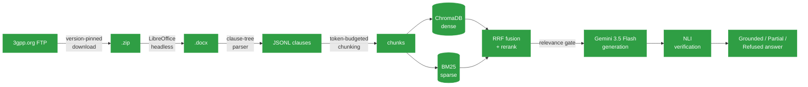

# SpecRAG

**Retrieval-augmented Q&A over official 3GPP Release-18 specifications.**

Ask a question about NR RRC procedures, 5G security, or NAS signaling and get an answer grounded in the actual standard text — with citations, not hallucinations.

<p>
  
  
  
  
  
</p>

---

## Why this exists

3GPP specifications are precise, cross-referenced, and *hostile* to keyword search. The same acronym means different things across series, requirements ("shall") are conditioned on clauses two pages away, and mixing spec releases silently produces answers that are internally consistent and completely wrong. Generic RAG-over-PDF tooling ignores all of this. SpecRAG is built around it.

## What makes it different

<table>
<tr><td width="34"><b>1</b></td><td><b>Version pinning is load-bearing, not cosmetic.</b><br>Every spec is resolved to a single 3GPP Release (18, "5G-Advanced") at download time, and the exact version is written to a manifest. Rel-15 and Rel-18 text can flatly contradict each other — retrieval doesn't know that, so the pipeline has to.</td></tr>
<tr><td><b>2</b></td><td><b>Chunking respects the clause tree, not the page.</b><br>The parser walks the docx body in document order (not python-docx's disconnected paragraph/table lists) to keep a <code>shall</code> and its triggering condition in the same chunk. Tables become GFM markdown; ASN.1 blocks are kept intact by paragraph style, not regex guessing.</td></tr>
<tr><td><b>3</b></td><td><b>A relevance gate before the LLM ever runs.</b><br>Hybrid dense + BM25 retrieval is fused (RRF) and reranked; below a calibrated score threshold, the system refuses rather than lets the LLM improvise from noise.</td></tr>
<tr><td><b>4</b></td><td><b>Answers are checked against source text before being shown.</b><br>An NLI verification pass grades every generated claim <em>Grounded</em>, <em>Partial</em> (unsupported parts stripped), or <em>Refused</em> — so a wrong answer about a protocol parameter doesn't quietly ship.</td></tr>
</table>

## Pipeline



## Status

The full pipeline is built and the index is live: **9,577 chunks / 4.94M tokens
across 15 Release-18 specs**, embedded with bge-m3 and indexed in both ChromaDB
and BM25.

| Stage | Module | State |
|---|---|---|
| Download + version pin | `src/ingest/download.py` | ✅ Done |
| `.doc` → `.docx` normalization | `src/ingest/convert.py` | ✅ Done |
| Clause-tree parsing | `src/ingest/parse_docx.py` | ✅ Done |
| Structure-aware chunking | `src/ingest/chunk.py` | ✅ Done — 0 orphaned conditions |
| Dense index (bge-m3 → ChromaDB) | `src/index/` | ✅ Done — 9,577 vectors |
| Sparse index (BM25, hand-rolled) | `src/index/bm25_store.py` | ✅ Done — 53,134 terms |
| Retrieval (RRF fusion + rerank) | `src/retrieval/` | ✅ Done |
| Generation (Gemini) | `src/generation/answer.py` | ✅ Done |
| Verification (NLI + LLM judge) | `src/verification/` | ✅ Done |
| API (FastAPI) | `src/api/main.py` | ✅ Done |
| UI (Streamlit) | `src/ui/app.py` | ✅ Done |
| Gate calibration | `eval/calibrate.py` | ✅ Done — threshold fitted |
| Ablation study | `eval/run_eval.py` | 🟡 Retrieval done; answer arms pending |

## Results

### Retrieval ablation (55 answerable questions)

Each arm is the real pipeline with stages switched off, not a re-implementation
— `Retriever()` takes the ablation flags directly, so an arm cannot accidentally
flatter itself.

| Arm | Recall@6 | Recall@20 | MRR@20 | nDCG@6 | s/query |
|---|---|---|---|---|---|
| A — dense only | 0.818 | 0.945 | 0.588 | 0.635 | 0.05 |
| B — + hybrid (BM25 + RRF) | 0.855 | **0.927** | 0.660 | 0.703 | 0.04 |
| C — + cross-encoder rerank | 0.855 | 0.927 | **0.679** | 0.704 | 1.74 |

Read honestly, this table says three things, and only the first is flattering:

- **Hybrid retrieval earns its place.** Recall@6 +3.7pts, MRR +7.2pts, nDCG
  +6.8pts, at no measurable latency cost. Exact-term matching is worth a lot in
  a corpus this full of acronyms and IE names.
- **Hybrid also *costs* recall deeper in the list** — Recall@20 drops from 0.945
  to 0.927. RRF pulls BM25 hits into the candidate pool that displace dense hits
  which were further down but still correct. Better at the top, slightly worse
  at the tail.
- **The cross-encoder barely moves retrieval metrics** (+1.9pts MRR, +0.1pt
  nDCG) while costing ~40× the latency. Its real justification in this system is
  not ranking — it is that it produces the score the relevance gate needs. There
  is no gate without it.

### Gate calibration

`RERANK_SCORE_THRESHOLD` was a placeholder of `0.0`. Calibration found that the
reranker emits **sigmoid outputs in [0, 1]**, not the signed logits the code
assumed — so `score < 0.0` was never true and **the gate had never fired once**.

Fitted on the 77-question gold set (`eval/calibrate.py`), maximising
correct-refusal subject to a 10% false-refusal budget:

| | |
|---|---|
| **Threshold** | **0.90** |
| Refuses unanswerable | 77% (17/22) |
| Refuses answerable (the price) | 4% (2/55) |
| Youden's J optimum (reference) | 0.90 — agrees |

The 5 out-of-scope questions that still get through are all *plausible fiction*
— `RRCQuantumResume`, `drx-NeuralInactivityTimer`, `Predictive Buffer Status
Report`. They reuse real 3GPP vocabulary, so the reranker legitimately finds
related passages and scores them high. Catching those is precisely the job of
controls #3 and #4 downstream.

## Corpus (Release 18)

<details>
<summary><b>15 specs across RAN, core network, security, and vocabulary</b> — click to expand</summary>
<br>

| Series | Spec | Title |
|---|---|---|
| RAN | 38.300 | NR and NG-RAN Overall Description |
| RAN | 38.331 | NR RRC Protocol Specification |
| RAN | 38.321 | NR MAC Protocol Specification |
| RAN | 38.322 | NR RLC Protocol Specification |
| RAN | 38.323 | NR PDCP Protocol Specification |
| RAN | 38.401 | NG-RAN Architecture Description |
| RAN | 38.211 | NR Physical Channels and Modulation |
| RAN | 38.212 | NR Multiplexing and Channel Coding |
| RAN | 38.213 | NR Physical Layer Procedures for Control |
| RAN | 38.214 | NR Physical Layer Procedures for Data |
| Core | 23.501 | System Architecture for the 5G System |
| Core | 23.502 | Procedures for the 5G System |
| Core | 24.501 | NAS Protocol for 5G System |
| Security | 33.501 | Security Architecture and Procedures for 5G System |
| Vocabulary | 21.905 | Vocabulary for 3GPP Specifications |

</details>

## Quick start

> Windows / PowerShell, from inside `rag3gpp/`. GPU (CUDA) is required — embedding this corpus on CPU is impractically slow.

```powershell
# 1. Virtual environment
python -m venv venv
.\venv\Scripts\Activate.ps1

# 2. PyTorch with CUDA — before everything else, or you'll silently get a CPU build
pip install torch --index-url https://download.pytorch.org/whl/cu121
python -c "import torch; print(torch.cuda.is_available())"   # must print True

# 3. Everything else
pip install -r requirements.txt

# 4. API key
copy .env.example .env
# open .env, paste your Gemini key from https://aistudio.google.com/apikey

# 5. LibreOffice (for legacy .doc -> .docx conversion)
# https://www.libreoffice.org/download
```

Full walkthrough, troubleshooting table, and what to expect at each step: [SETUP.md](SETUP.md).

### Run the pipeline

Every module runs standalone with `python -m` and has a self-check, so each
stage can be verified before the next is built on it.

```powershell
# --- offline: corpus -> index ---
python -m src.ingest.download --spec 38.331   # one spec first, to prove the plumbing
python -m src.ingest.download                 # then the full Rel-18 corpus
python -m src.ingest.convert                  # normalise any .doc -> .docx
python -m src.ingest.parse_docx               # clause-tree JSONL
python -m src.ingest.chunk                    # must report 0 orphaned conditions

python -m src.index.embedder --self-test      # proves GPU + fp16 + query prefix
python -m src.index.build --limit 200 --reset # smoke test
python -m src.index.build --reset             # full run, ~15 min on GPU
python -m src.index.bm25_store --build

# --- online ---
python -m src.retrieval.pipeline --query "When does the UE trigger T310?" --explain
python -m src.generation.answer --query "..."
python -m src.verification.groundedness --query "..."

uvicorn src.api.main:app --port 8000
streamlit run src/ui/app.py

# --- evaluation ---
python -m eval.calibrate                      # fit the relevance-gate threshold
python -m eval.run_eval --retrieval           # ablation, GPU only, no API calls
python -m eval.run_eval --answers             # ablation, calls Gemini
```

Two checks that gate the rest: `src.ingest.chunk` must report **0 orphaned
conditions** before you build an index on it, and every row of
`data/raw/manifest.tsv` must say `Rel-18`. A row that doesn't means that spec
has no Rel-18 version published and the downloader fell back to the newest
available, which silently breaks version pinning.

## Project layout

```
rag3gpp/
├── src/
│   ├── config.py          # every tunable constant — thresholds, model names, paths
│   ├── ingest/
│   │   ├── download.py    # version-pinned fetch from 3gpp.org
│   │   ├── convert.py     # .doc -> .docx via LibreOffice headless
│   │   └── parse_docx.py  # docx -> clause-tree JSONL
│   │   └── chunk.py       # clause tree -> chunks, conditions preserved
│   ├── index/              # bge-m3 embedder, ChromaDB store, BM25, build
│   ├── retrieval/          # RRF fusion + cross-encoder rerank + gate
│   ├── generation/         # Gemini answer synthesis, citation validation
│   ├── verification/       # NLI + LLM-judge grounding checks
│   ├── llm_retry.py        # backoff for transient Gemini failures
│   ├── api/                # FastAPI service
│   └── ui/                 # Streamlit front end
├── eval/                   # gold set, gate calibration, ablation harness
├── data/                    # raw/docx/parsed/chunks/index — gitignored except manifest
├── SETUP.md
└── requirements.txt
```

## Tech stack

Python 3.11 · PyTorch (CUDA) · sentence-transformers (`BAAI/bge-m3`) · `bge-reranker-v2-m3` · ChromaDB · rank-bm25 · Gemini 3.5 Flash · cross-encoder NLI · FastAPI · Streamlit
